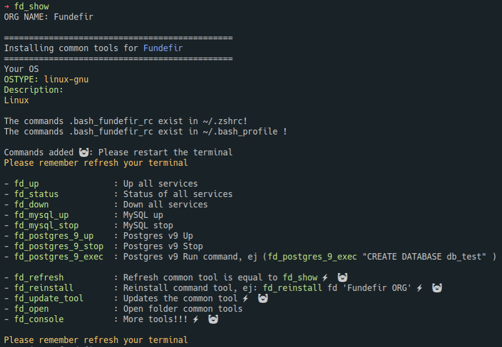

# Common tools for Fundefir

### Getting started

Execute the installing ❤️ `./install.sh`, it's all, please refresh your terminal.

For view all the services available:

[README_global.md](./README_global.md)
